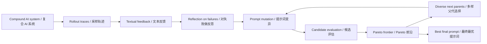
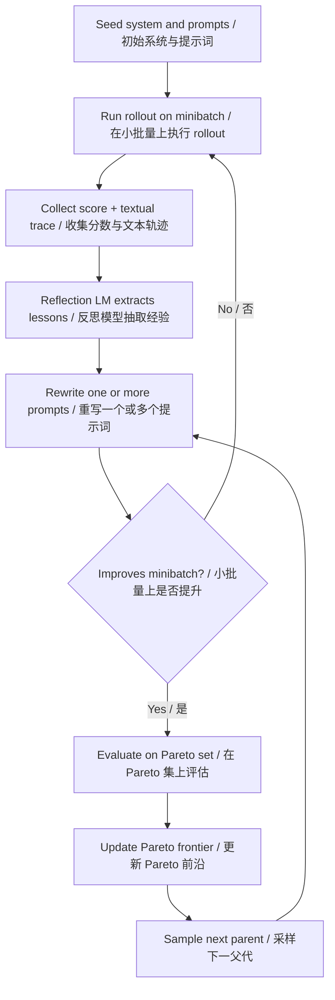

# GEPA / Reflective Prompt Evolution Report

## Executive Summary / 执行摘要

**English.** This paper introduces **GEPA** (Genetic-Pareto), a method for optimizing prompts in compound AI systems by turning rollout traces into natural-language feedback, then using reflection-guided prompt mutation plus Pareto-based candidate selection. The paper's main empirical claim is not that prompt evolution universally replaces RL, but that on the paper's evaluated tasks it often reaches stronger results than GRPO and prompt-optimization baselines with many fewer rollouts under the reported setup (Abstract, PDF p. 1; Sec. 4, PDF pp. 8-10; Table 1; Table 2; Figure 1).

**中文。** 这篇论文提出了 **GEPA**（Genetic-Pareto）：一种面向复合 AI 系统的提示词优化方法。它把 rollout 轨迹转成自然语言反馈，再通过“反思式提示词变异”与 Pareto 候选选择来持续改进系统。论文最重要的经验性结论并不是“提示词进化普遍替代 RL”，而是：在本文评测的任务与预算设定下，它经常能用更少的 rollout 获得比 GRPO 和若干提示优化基线更强的结果（摘要，PDF 第 1 页；第 4 节，PDF 第 8-10 页；表 1；表 2；图 1）。

**What I think the paper most usefully teaches / 我认为这篇论文最值得学的概念。**
- **Paper claim / 论文主张**: language is a richer learning medium than sparse scalar reward for many prompt-level system improvements (Abstract, PDF p. 1; Introduction, PDF p. 2).
- **My interpretation / 我的解读**: the core concept is **reflective prompt evolution**: use the model to read its own failures in text form, extract reusable rules, and search prompt space without updating weights.

## Prerequisite Context / 先修背景

### Background you should know first / 最好先知道的背景

- **RLVR / Reinforcement Learning with Verifiable Rewards**: optimize a model with scalar rewards derived from whether outputs satisfy a checkable criterion. The paper uses GRPO as its main representative example (Introduction, PDF p. 2).
- **GRPO**: a reinforcement-learning method that uses relative rewards across sampled outputs. In this paper it is the strongest RL comparator, but it operates in weight space rather than prompt space (Introduction, PDF p. 2; Sec. 4, PDF pp. 8-9).
- **Prompt optimization**: improve a system by changing instructions, demonstrations, or prompt structure rather than changing model weights. GEPA belongs here, alongside methods like MIPROv2 and TextGrad (Sec. 6, PDF p. 15; Appendix E.4, PDF pp. 25-26).
- **Pareto frontier**: instead of keeping only one global best candidate, keep candidates that are best on at least one instance and not strictly dominated. GEPA uses this to avoid greedy local optima (Sec. 3.1, PDF pp. 6-7; Figure 6; Table 3).
- **Compound AI system**: a modular workflow with one or more LLM calls, control flow, and optional tool calls. GEPA is designed for this setting, not just single-prompt tasks (Sec. 2, PDF pp. 3-4).

### Missing background the paper mostly assumes / 论文基本默认你已经懂的部分

- Why RL methods can be sample-inefficient when tool use is expensive.
- Why prompt-level optimization can matter even when model weights stay fixed.
- How multi-objective search differs from greedy search.
- Why natural-language traces can contain richer error information than a single scalar score.

## Glossary And Notation / 术语与记号

| Term / 术语 | Meaning / 含义 |
| --- | --- |
| `Φ = (M, C, X, Y)` | Formalization of a compound AI system: modules `M`, control flow `C`, global input schema `X`, and output schema `Y` (Sec. 2, PDF pp. 3-4). / 复合 AI 系统的形式化：模块 `M`、控制流 `C`、输入模式 `X`、输出模式 `Y`（第 2 节，PDF 第 3-4 页）。 |
| `Mi = (πi, θi, Xi, Yi)` | A module with prompt `πi`, model weights `θi`, and input/output schemas (Sec. 2, PDF pp. 3-4). / 单个模块，包括提示词 `πi`、模型权重 `θi`、输入输出模式（第 2 节，PDF 第 3-4 页）。 |
| `ΠΦ` | The collection of prompts inside the system. GEPA changes this. / 系统中的提示词集合。GEPA 主要优化它。 |
| `ΘΦ` | The collection of model weights. GEPA keeps these fixed. / 系统中的模型权重集合。GEPA 保持它不变。 |
| Rollout | One execution trace of the system, including prompts, reasoning, tool calls, outputs, and feedback (Abstract, PDF p. 1; Sec. 1, PDF p. 2). / 一次系统执行轨迹，包括提示词、推理、工具调用、输出和反馈（摘要，PDF 第 1 页；第 1 节，PDF 第 2 页）。 |
| Reflection LM | The model used to read traces and produce natural-language feedback or prompt updates (Sec. 3; Appendix C, PDF pp. 22-23). / 用于读取轨迹并生成自然语言反馈或提示词更新的模型（第 3 节；附录 C，PDF 第 22-23 页）。 |
| `Dfeedback` | Data subset used to generate reflective update signal (Algorithm 1, PDF p. 6). / 用来产生反思更新信号的数据子集（算法 1，PDF 第 6 页）。 |
| `Dpareto` | Data subset used to track which candidates remain Pareto-optimal (Algorithm 1, PDF p. 6). / 用来跟踪哪些候选仍在 Pareto 前沿上的数据子集（算法 1，PDF 第 6 页）。 |

## Paper Walkthrough / 论文导读

### 1. Problem Statement / 问题定义

**Paper claim / 论文主张。** RLVR methods such as GRPO can be effective, but often need very large rollout budgets; this becomes costly for compound systems with expensive inference or tool use (Introduction, PDF p. 2). The paper therefore studies optimization of a compound AI system under a rollout budget, formalizing the system and the optimization target in Sec. 2 (Sec. 2, PDF pp. 3-4).

**My interpretation / 我的解读。** The paper is really asking: if the failure traces are already in language, why throw most of that structure away and learn only from scalar rewards? GEPA is the paper's answer: search prompt space using textual self-critique instead of using RL to move weights.

### 2. Contribution / 主要贡献

**Paper claim / 论文主张。**
- A reflective prompt optimizer for arbitrary compound AI systems (Abstract, PDF p. 1; Sec. 3, PDF pp. 5-7).
- A Pareto-based candidate-selection strategy to reduce local-optimum failures (Sec. 3.1, PDF pp. 6-7; Figure 6; Table 3).
- Strong results against GRPO, MIPROv2, Trace, and TextGrad across six tasks and two model families (Sec. 4, PDF pp. 8-10; Table 1; Table 2).
- Promising demonstrations for inference-time code optimization and adversarial prompt search (Sec. 5, PDF pp. 11-14).

**My interpretation / 我的解读。** The most transferable contribution is not a single benchmark win. It is the design pattern:
1. serialize rich system traces,
2. let an LLM verbalize reusable lessons,
3. search prompt space while preserving diversity,
4. validate cautiously rather than trusting one lucky candidate.

### 3. Method / 方法

**Paper claim / 论文主张。** GEPA samples trajectories, obtains natural-language feedback, mutates prompts, evaluates candidates, and maintains a Pareto frontier instead of always selecting the current global best candidate (Sec. 3, PDF pp. 5-7; Figure 3; Algorithm 1; Sec. 3.1; Algorithm 2). Appendix C gives the meta-prompt used for reflective prompt updates, and Figure 5 illustrates how prompt refinements accumulate on PUPA (Appendix C, PDF pp. 22-23; Figure 5, PDF p. 7).

**My interpretation / 我的解读。** GEPA combines two ideas that are individually familiar but interesting together:
- **reflection** gives rich local edit suggestions;
- **Pareto selection** stops the search from collapsing too early onto one seemingly best prompt.

That pairing is the concept to remember.

### 4. Experiments / 实验

**Paper claim / 论文主张。** The main benchmarks are HotpotQA, IFBench, HoVer, PUPA, AIME-2025, and LiveBench-Math, tested on Qwen3 8B and GPT-4.1 Mini (Sec. 4, PDF pp. 8-10). Figure 1 shows rollout-performance curves for HotpotQA and IFBench; Table 1 and Table 2 summarize benchmark results; Table 3 isolates the effect of candidate-selection strategy (Figure 1; Table 1; Table 2; Table 3).

**My interpretation / 我的解读。** The paper's experimental story has three layers:
- headline comparisons against GRPO and prompt baselines,
- an ablation story about Pareto candidate selection,
- a broader "maybe this works beyond prompt tuning" story in Sec. 5.

The first two are well supported. The third is promising but still preliminary.

### 5. Limitations / 局限

**Paper claim / 论文主张。** The paper does not present a standalone limitations section. The clearest self-acknowledged caveat is that most of GEPA's rollout budget is spent on validation tracking, and the authors suggest smaller or dynamically selected validation subsets as future work (Sec. 4, PDF p. 9). Appendix F also notes that evaluation-time budgets across optimizers are not perfectly identical, though the reported difference is kept within 10.15% (Appendix F, PDF p. 27).

**My interpretation / 我的解读。** The paper is strong as an empirical case study, but not as a universal law. Its conclusions are bounded by:
- the chosen tasks,
- the chosen feedback functions,
- the chosen model families,
- and the fact that the method depends on useful textual traces.

## Claims Vs Interpretation / 论文主张与我的解读

| Topic / 主题 | What the paper directly claims / 论文直接主张 | My cautious interpretation / 我的谨慎解读 |
| --- | --- | --- |
| Sample efficiency / 样本效率 | GEPA can beat GRPO by up to 20% with up to 35x fewer rollouts on reported tasks (Abstract, PDF p. 1; Sec. 4, PDF p. 9). | Strong within the reported setup, but sensitive to how total rollout budget is counted because validation dominates much of GEPA's budget. |
| Cross-model transfer / 跨模型迁移 | `GEPA-Qwen-Opt` transfers from Qwen3 8B to GPT-4.1 Mini and outperforms GPT-4.1-Mini-optimized baselines in Table 2 (Table 2, PDF p. 8). | Promising one-directional transfer result, not a general cross-model guarantee. |
| General superiority over RL / 普遍优于 RL | The abstract and introduction position GEPA as outperforming GRPO on average across the evaluated tasks (Abstract, PDF p. 1; Introduction, PDF p. 2). | True as an aggregate claim, but not a per-cell universal win. The tables should be read task by task. |
| Inference-time search beyond prompt tuning / 超出提示词优化的推理时搜索 | Sec. 5 shows promising code-optimization and adversarial-search applications (Sec. 5, PDF pp. 11-14). | Interesting extension, but still closer to "promising demo" than "fully established capability." |

## Concept Map / 概念图

## Method Diagram / 方法图

## Evidence Table / 证据表

| Claim / 论断 | Evidence / 证据 | Strength / 强度 | Notes / 说明 |
| --- | --- | --- | --- |
| GEPA optimizes prompts, not weights. / GEPA 优化提示词而非权重。 | Sec. 2, PDF pp. 3-4. | High / 高 | The notation allows both prompts and weights, but GEPA's implementation updates prompts. / 记号层面允许两者，但实现中更新的是提示词。 |
| GEPA often beats GRPO under the paper's setup. / 在本文设定下，GEPA 常常优于 GRPO。 | Abstract, PDF p. 1; Table 1; Table 2; Figure 1. | High for aggregate claim / 对汇总结论较高 | Do not read this as "wins every task cell." / 不要把它读成“每个单元格都赢”。 |
| Pareto sampling matters materially. / Pareto 采样确实重要。 | Sec. 3.1, PDF pp. 6-7; Figure 6; Table 3. | Moderate to high / 中高 | The evidence is empirical rather than theoretical. / 证据是经验性的，不是理论保证。 |
| Validation dominates GEPA's rollout cost. / GEPA 的 rollout 成本主要花在验证上。 | Sec. 4, PDF p. 9: the paper notes GEPA used only 102, 32, 6, and 179 train rollouts on four tasks, and that validation tracking accounts for most of the rollout budget. | High / 高 | This is the key caveat for sample-efficiency interpretation. / 这是解读样本效率时最关键的 caveat。 |
| `GEPA+Merge` is not uniformly better than `GEPA`. / `GEPA+Merge` 并不总是优于 `GEPA`。 | Table 1; Table 2, PDF p. 8. | High / 高 | Example: on GPT-4.1 Mini, GEPA wins HotpotQA while GEPA+Merge wins IFBench aggregate-wise; performance is mixed by task. / 不同任务上有赢有输，不能当作单调改进。 |
| Cross-model transfer is promising. / 跨模型迁移有潜力。 | Table 2 row `GEPA-Qwen-Opt`, PDF p. 8. | Moderate / 中等 | Useful evidence, but only one main transfer direction is shown. / 证据有价值，但只展示了一个主要方向。 |
| Code optimization results are promising but early. / 代码优化结果有潜力，但仍偏早期。 | Sec. 5.1, PDF pp. 11-12. | Moderate / 中等 | The paper itself says these are early results warranting further study. / 论文自己也说这部分还需要进一步系统研究。 |

## Figures, Tables, And Notation To Read Carefully / 需要谨慎阅读的图表与记号

- **Figure 1 / 图 1**: the lines are rollout-learning curves, while the star markers indicate held-out test performance. Do not collapse these into one kind of evidence. / 曲线是 rollout 学习过程，星形标记是测试集表现，两者不是同一种证据。
- **Figure 2 / 图 2**: an existence proof that GEPA can accumulate rich prompt rules, not proof that longer prompts are always better. / 它说明 GEPA 能累积复杂规则，但不证明“提示词越长越好”。
- **Figure 3 / 图 3**: workflow visualization, not an ablation. / 这是流程图，不是消融结果。
- **Figure 5 / 图 5**: a qualitative subtree from PUPA; useful for intuition, not for quantitative comparison. / 来自 PUPA 的定性子树，更适合建立直觉，不适合定量比较。
- **Table 1 / 表 1**: read per benchmark, not only aggregate. One aggregate headline can hide task-level variation. / 要按单任务读，而不是只看 aggregate。
- **Table 2 / 表 2**: supports cross-model transfer, but mainly one-directionally. / 支持跨模型迁移，但主要是单向证据。
- **Section 2 notation / 第 2 节记号**: the formal setup allows prompt and weight optimization, but the actual method keeps weights fixed. / 形式化允许优化权重与提示词，但实际方法固定权重。

## Caveats / 注意事项

**English.**
- The paper is empirical, not a proof that reflective prompt evolution generally dominates RL.
- The headline "up to 35x fewer rollouts" depends on the paper's budget accounting, and the authors themselves note that validation tracking consumes most of GEPA's rollout budget (Sec. 4, PDF p. 9).
- Aggregate wins should not be misread as universal task-by-task wins.
- GEPA seems best suited to settings where failures are visible in text and can be verbalized into useful rules.

**中文。**
- 这篇论文提供的是经验性证据，不是“反思式提示词进化普遍优于 RL”的证明。
- “最高少 35x rollout” 依赖论文的预算统计口径，而且作者自己也指出 GEPA 的大部分 rollout 成本花在验证跟踪上（第 4 节，PDF 第 9 页）。
- 汇总胜利不能误读成每个任务、每个表格单元都稳赢。
- GEPA 看起来最适合那类“失败能以文本形式暴露出来，并能被总结成规则”的场景。

## Open Questions / 开放问题

1. How much of the gain comes from reflection itself, and how much from Pareto selection?  
   提升里究竟有多少来自“反思”，多少来自 Pareto 选择？
2. What happens when feedback is sparse, delayed, noisy, or partly non-textual?  
   如果反馈稀疏、延迟、噪声更大，或者并不完全是文本，会发生什么？
3. How much can rollout cost drop if validation is made smaller or dynamically sampled?  
   如果验证集更小，或者改成动态抽样，rollout 成本能下降多少？
4. Does this approach still help when the bottleneck is model capability rather than prompt quality?  
   如果瓶颈是模型能力而不是提示词质量，这套方法还是否有效？

## Follow-Up Reading / 延伸阅读

- GRPO and RLVR basics / GRPO 与 RLVR 基础
- MIPROv2 and TextGrad as prompt-optimization baselines / 把 MIPROv2、TextGrad 当作提示优化基线来读
- Pareto search and multi-objective optimization / Pareto 搜索与多目标优化
- Compound AI systems and agent scaffolding / 复合 AI 系统与 agent scaffolding

## Visual Asset Note / 可视化说明

**English.** I used Markdown-native Mermaid diagrams for the concept map and method diagram because they were sufficient to explain the paper's mechanics. I did not add an AI-generated bitmap asset here because it would be more decorative than clarifying.

**中文。** 这里我使用了 Markdown 原生 Mermaid 图来表达概念图和方法图，因为它们已经足够解释论文机制。我没有额外加入 AI 生成位图资产，因为在这个场景下它更偏装饰性，而不是解释性。
