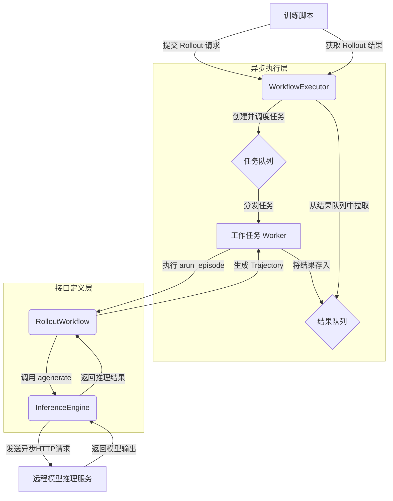

# prime-rl 异步训练设计文档

## 1. 高层架构概述

在强化学习（RL）中，训练智能体（agent）通常需要大量的环境交互来收集经验，这个过程被称为“rollout”或“trajectory sampling”。传统的同步 rollout 方式效率低下，因为在与环境或模型交互时，计算资源会处于闲置等待状态。

`prime-rl` 采用了先进的异步训练架构，以最大化资源利用率并加速数据收集过程。该架构的核心是利用 Python 的 `asyncio` 库，实现非阻塞的 I/O 操作，从而允许系统在等待一个任务（如模型推理）完成时，可以切换到执行其他任务，实现计算和通信的高度重叠。

该异步架构主要由以下几个核心组件构成：

*   **`WorkflowExecutor` (工作流执行器)**: 这是异步 rollout 过程的中央调度器。它负责管理一个工作任务池，接收上层训练脚本提交的 rollout 请求，并将其分发给工作任务并发执行。
*   **`RolloutWorkflow` (Rollout 工作流)**: 这是一个接口，定义了单个 rollout episode（回合）的具体逻辑。开发者可以实现这个接口来定制不同的 rollout 策略（例如，多轮对话、代码生成等）。
*   **`InferenceEngine` (推理引擎)**: 这是与模型推理服务器交互的抽象层。它将底层的网络通信（如 HTTP 请求）封装起来，为上层提供一个简洁的异步 `agenerate` 方法，用于获取模型的响应。

这三个组件协同工作，使得 `prime-rl` 能够同时处理成百上千个 rollout 任务，极大地提升了训练数据的生产效率。

## 2. 架构图

下面是 `prime-rl` 异步训练架构的流程图，使用 Mermaid 语法绘制：



**流程解读:**
1.  **提交请求**: 训练脚本向 `WorkflowExecutor` 提交数据收集请求。
2.  **任务调度**: `WorkflowExecutor` 将请求封装成 `RolloutWorkflow` 任务，放入任务队列，并由其内部的 Worker 进行并发处理。
3.  **执行任务**: 每个 Worker 从队列中获取任务，并调用 `RolloutWorkflow` 实例的 `arun_episode` 方法。
4.  **模型推理**: `arun_episode` 方法内部调用 `InferenceEngine` 的 `agenerate` 方法，该方法通过 `aiohttp` 向远程推理服务器发起一个非阻塞的 HTTP 请求。
5.  **结果收集**: 请求完成后，`InferenceEngine` 返回结果，`RolloutWorkflow` 处理响应并生成 trajectory（轨迹），最后由 `WorkflowExecutor` 收集并返回给训练脚本。

## 3. 核心代码深入分析

### 3.1. `WorkflowExecutor`: 异步流程的“大脑”

`WorkflowExecutor` 是整个异步 rollout 机制的调度核心。它通过内部维护的任务队列和结果队列，实现了任务的提交与结果的回收。

**任务提交 (`submit`)**:
`submit` 方法接收 rollout 所需的数据和工作流定义，并将其添加到一个待处理的任务列表中。

```python
# 引用自: areal/core/workflow_executor.py
class WorkflowExecutor:
    # ...
    def submit(
        self,
        data: dict[str, Any],
        workflow: RolloutWorkflow | type[RolloutWorkflow] | str,
        # ...
    ) -> None:
        # ...
        self._pending_inputs.append(
            _RolloutTaskInput(
                data=data,
                workflow=resolved_workflow,
                # ...
            )
        )
```

**结果等待 (`wait`)**:
`wait` 方法会阻塞，直到收集到指定数量的 rollout 结果。在等待期间，它会检查系统容量，并持续地将待处理任务提交给底层的 `AsyncTaskRunner` 执行。

```python
# 引用自: areal/core/workflow_executor.py
class WorkflowExecutor:
    # ...
    def wait(
        self, count: int, timeout: float | None = None, # ...
    ) -> dict[str, Any] | NoResult:
        # ...
        while True:
            # ...
            capacity = self.get_capacity()
            # 提交待处理的任务
            for _ in range(capacity):
                if len(self._pending_inputs) == 0:
                    break
                self._commit_one_to_runner()

            if len(self._pending_results) >= count:
                break

            # 等待底层运行器返回结果
            batch = self.runner.wait(count=needed, timeout=...)
```

### 3.2. `RolloutWorkflow`: 定义单次 Rollout 的行为

`RolloutWorkflow` 是一个抽象基类，它强制实现 `arun_episode` 方法，从而将 rollout 的具体逻辑与上层调度器解耦。

```python
# 引用自: areal/api/workflow_api.py
class RolloutWorkflow(ABC):
    @abstractmethod
    async def arun_episode(
        self, engine: InferenceEngine, data: dict[str, Any]
    ) -> dict[str, Any] | None:
        # 子类需要实现此方法来定义一个 episode 的完整流程
        pass
```

在具体的实现中（如 `MultiTurnWorkflow`），`arun_episode` 方法会直接调用 `InferenceEngine` 来与模型交互。

```python
# 引用自: areal/workflow/multi_turn.py
class MultiTurnWorkflow(RolloutWorkflow):
    # ...
    async def _run_one_episode(
        self, engine: InferenceEngine, data: dict[str, Any]
    ) -> ...:
        # ...
        # 异步调用推理引擎
        resp = await engine.agenerate(req)
        # ...
        return trajectory
```

### 3.3. `InferenceEngine`: 封装异步网络通信

`InferenceEngine` 及其实现（如 `RemoteSGLangEngine` 和 `RemoteInfEngine`）是实现非阻塞 I/O 的关键。它使用 `aiohttp` 库来发起异步 HTTP 请求。

`RemoteInfEngine` 的 `agenerate` 方法是核心：

```python
# 引用自: areal/core/remote_inf_engine.py
class RemoteInfEngine:
    # ...
    async def agenerate(self, req: ModelRequest) -> ModelResponse:
        # ...
        # 创建一个 aiohttp 客户端会话
        async with aiohttp.ClientSession(...) as session:
            # ...
            # 循环直到生成停止
            while stop_reason not in ["stop", "tool_calls", "length"] and ...:
                # ...
                # arequest_with_retry 是一个封装了重试逻辑的异步请求函数
                result = await arequest_with_retry(
                    session=session,
                    addr=server_addr,
                    # ...
                )
```
通过 `await` 关键字，程序在等待网络响应时不会被阻塞，而是会将控制权交还给 `asyncio` 的事件循环，从而可以去执行其他已就绪的任务。

## 4. 代码示例

下面的示例代码模拟了 `prime-rl` 的异步 rollout 流程。它展示了如何并发地运行多个 rollout 工作流，并高效地从一个模拟的推理引擎中收集结果。

```python
import asyncio
import random
import time
from typing import Any, Dict, List

# --- 模拟 AReaL 的核心组件 ---

class MockModelRequest:
    """模拟模型请求对象。"""
    def __init__(self, input_ids: List[int]):
        self.input_ids = input_ids

    def __repr__(self):
        return f"MockModelRequest(input_ids={self.input_ids})"

class MockModelResponse:
    """模拟模型响应对象。"""
    def __init__(self, output_tokens: List[int]):
        self.output_tokens = output_tokens

    def __repr__(self):
        return f"MockModelResponse(output_tokens={self.output_tokens})"

class MockInferenceEngine:
    """
    模拟推理引擎，它会异步地处理请求。
    """
    async def agenerate(self, req: MockModelRequest) -> MockModelResponse:
        """模拟对远程模型的异步调用。"""
        print(f"[{time.strftime('%H:%M:%S')}] 引擎收到请求: {req}")

        # 模拟网络延迟和模型处理时间
        delay = random.uniform(0.5, 2.0)
        await asyncio.sleep(delay)

        # 模拟模型生成一些输出 token
        output_tokens = [random.randint(1, 100) for _ in range(10)]
        response = MockModelResponse(output_tokens)

        print(f"[{time.strftime('%H:%M:%S')}] 引擎发送响应: {response} (延迟 {delay:.2f}s)")
        return response

class SimpleRolloutWorkflow:
    """
    RolloutWorkflow 的一个简化版本。
    """
    def __init__(self, workflow_id: int):
        self.workflow_id = workflow_id

    async def arun_episode(
        self, engine: MockInferenceEngine, data: Dict[str, Any]
    ) -> Dict[str, Any]:
        """
        运行单个 rollout episode，模拟与模型的交互。
        """
        print(f"[{time.strftime('%H:%M:%S')}] 工作流-{self.workflow_id}: 开始 episode, 数据: {data}")

        # 1. 从输入数据创建请求
        prompt_ids = data.get("prompt_ids", [0])
        request = MockModelRequest(input_ids=prompt_ids)

        # 2. 异步调用推理引擎
        response = await engine.agenerate(request)

        # 3. 处理响应以创建 "trajectory"
        trajectory = {
            "prompt_ids": prompt_ids,
            "output_ids": response.output_tokens,
            "reward": random.random() # 分配一个随机奖励
        }

        print(f"[{time.strftime('%H:%M:%S')}] 工作流-{self.workflow_id}: 完成 episode. Trajectory: {trajectory}")
        return trajectory

# --- 主执行逻辑 ---

async def main():
    """
    模拟 WorkflowExecutor 的行为，并发运行多个 rollout 工作流。
    """
    print("--- prime-rl 异步 Rollout 示例 ---")
    start_time = time.time()

    # 1. 初始化模拟的推理引擎
    mock_engine = MockInferenceEngine()

    # 2. 定义要并发运行的 rollout 数量
    num_concurrent_rollouts = 5
    print(f"\n开始 {num_concurrent_rollouts} 个并发 rollouts...")

    # 3. 创建工作流实例和 asyncio 任务
    tasks = []
    for i in range(num_concurrent_rollouts):
        workflow = SimpleRolloutWorkflow(workflow_id=i + 1)
        # 在真实场景中，每个工作流的输入数据可能不同
        input_data = {"prompt_ids": [1, 2, 3 + i]}
        task = asyncio.create_task(workflow.arun_episode(mock_engine, input_data))
        tasks.append(task)

    # 4. 等待所有任务完成
    # asyncio.gather 会并发地运行这些任务
    results = await asyncio.gather(*tasks)

    end_time = time.time()

    print("\n--- 结果 ---")
    print(f"所有 {num_concurrent_rollouts} 个 rollouts 在 {end_time - start_time:.2f} 秒内完成。")
    print("收集到的 trajectories:")
    for i, trajectory in enumerate(results):
        print(f"  {i+1}: {trajectory}")

if __name__ == "__main__":
    asyncio.run(main())
```

**如何运行此示例:**
将代码保存为 `.py` 文件并执行。您会观察到，尽管每个任务都有随机延迟，但所有任务是并发执行的，总耗时远小于所有任务延迟时间的总和，这展示了异步执行的优势。
