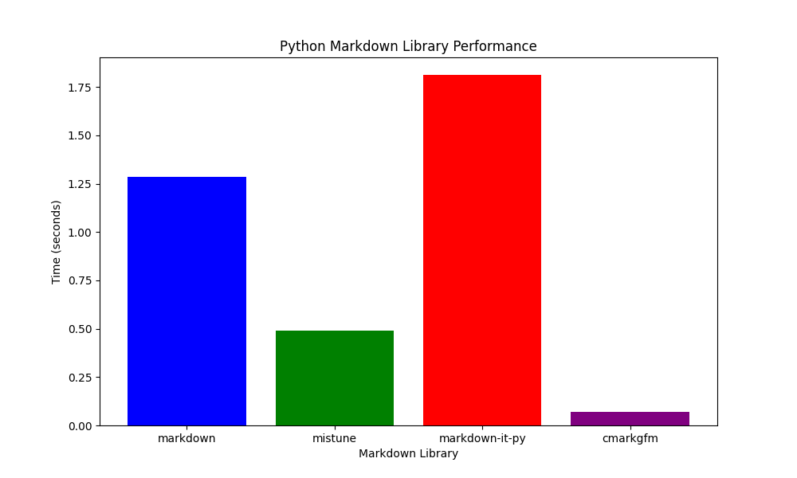

# Python Markdown Library Comparison

This report provides a feature comparison and performance benchmark of popular Python markdown libraries.

## Feature Comparison

| Library | CommonMark Compliant | GFM Support | Extensions | Security |
| --- | --- | --- | --- | --- |
| `markdown` | No | No | Yes | Provides an `html_sanitizer` extension. |
| `mistune` | Yes | Yes | Yes | Escapes HTML by default. |
| `markdown-it-py` | Yes | Via plugin | Yes | Allows for custom security settings. |
| `cmarkgfm` | Yes | Yes | No | Provides a `CMARK_OPT_SAFE` option. |

## Performance Benchmark

The following benchmark was run on a sample markdown file with a large amount of text. The results are the minimum of 10 runs of 10 iterations each.

```
markdown: 0.015297132999990026
mistune: 0.005073533999990332
markdown-it-py: 0.021814817000006315
cmarkgfm: 0.0007995219999941128
```

## Benchmark Visualization


