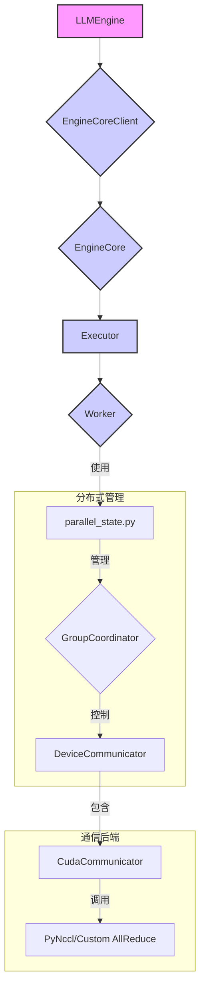

# vLLM 分布式推理实现分析报告

## 1. 引言

vLLM 是一个为大型语言模型（LLM）设计的高吞吐量、高内存效率的推理和服务引擎。它通过一系列创新技术，如 PagedAttention 和持续批处理（Continuous Batching），显著提升了 LLM 的推理性能。除了在单卡上的极致优化，vLLM 还提供了强大的分布式推理能力，以支持越来越庞大的模型。

本报告旨在深入分析 vLLM 的分布式推理实现，通过研究其源代码，揭示其架构设计、核心组件和关键技术。报告将包含代码片段和架构图，以帮助读者更好地理解 vLLM 如何实现高效、可扩展的分布式推理。

## 2. 核心概念

vLLM 的分布式推理主要围绕两种并行策略展开：张量并行（Tensor Parallelism）和流水线并行（Pipeline Parallelism）。

### 2.1 张量并行 (Tensor Parallelism)

张量并行是一种模型并行策略，它将模型的单个层（特别是权重矩阵）分割到多个设备（GPU）上。每个设备只持有一部分模型权重，并在推理过程中协同计算。vLLM 利用张量并行来解决单张 GPU 显存无法容纳整个模型的问题，同时也能通过并行计算加速推理速度。

例如，一个全连接层的前向传播可以表示为 `Y = XA`。如果我们将权重矩阵 `A` 按列切分到两个 GPU 上（`A = [A1, A2]`），那么每个 GPU 可以分别计算 `Y1 = XA1` 和 `Y2 = XA2`，最后通过 `all-gather` 操作将 `Y1` 和 `Y2` 拼接成最终的结果 `Y`。

### 2.2 流水线并行 (Pipeline Parallelism)

流水线并行是另一种模型并行策略，它将模型的不同层分配到不同的设备上。输入数据在一个设备上完成一部分层的计算后，将中间结果传递给下一个设备继续计算，形成一个“流水线”。这种方式可以有效利用多个设备的计算资源，尤其适用于层数非常深的模型。

vLLM 的流水线并行实现允许将模型的不同阶段（stages）放置在不同的 GPU 上，从而实现跨设备的长序列推理。

## 3. 架构概览

vLLM 的分布式推理架构设计精良，通过模块化的组件实现了灵活的并行策略。其核心在于对分布式通信的抽象和管理。

### 3.1 架构图

以下是 vLLM 分布式推理的高层架构图，使用 Mermaid 语法绘制：



### 3.2 主要组件

*   **LLMEngine**: 用户交互的入口，负责接收和处理推理请求。
*   **EngineCore**: 推理引擎的核心，管理调度器和执行器。
*   **Executor**: 执行器，负责实际的模型计算。在分布式模式下，每个 Worker 都有一个 Executor 实例。
*   **Worker**: 在每个 GPU 上运行的进程，包含了模型的一部分。
*   **parallel_state.py**: 分布式状态管理模块，负责初始化和维护并行组（如张量并行组、流水线并行组）。
*   **GroupCoordinator**: 对 PyTorch `ProcessGroup` 的封装，提供了更高级的通信接口。
*   **DeviceCommunicator**: 设备间通信的抽象层，针对不同硬件（如 CUDA、TPU）有不同的实现。
*   **CudaCommunicator**: 针对 NVIDIA GPU 的通信实现，内部会根据情况选择最优的 `all_reduce` 等通信策略。

## 4. 源码分析

### 4.1 分布式状态管理 (`parallel_state.py`)

vLLM 的分布式功能始于 `parallel_state.py`，这个文件负责初始化和管理各种并行组。它借鉴了 Megatron-LM 的设计，但进行了vLLM特定的适配和优化。

#### 4.1.1 初始化

初始化的入口是 `init_distributed_environment` 和 `initialize_model_parallel`。

`init_distributed_environment` 函数负责初始化 PyTorch 的 `ProcessGroup`，建立进程间的通信基础。

`initialize_model_parallel` 函数则在此基础上，根据用户配置的张量并行和流水线并行大小，创建相应的通信组。例如，一个典型的张量并行组创建过程如下：

```python
# vllm/vllm/distributed/parallel_state.py

def initialize_model_parallel(
    tensor_model_parallel_size: int = 1,
    pipeline_model_parallel_size: int = 1,
    # ...
) -> None:
    # ...
    world_size: int = torch.distributed.get_world_size()

    all_ranks = torch.arange(world_size).reshape(
        # ...
        pipeline_model_parallel_size,
        tensor_model_parallel_size,
    )

    # Build the tensor model-parallel groups.
    global _TP
    assert _TP is None, "tensor model parallel group is already initialized"
    group_ranks = all_ranks.view(-1, tensor_model_parallel_size).unbind(0)
    group_ranks = [x.tolist() for x in group_ranks]

    _TP = init_model_parallel_group(
        group_ranks,
        get_world_group().local_rank,
        backend,
        use_message_queue_broadcaster=True,
        group_name="tp",
    )
    # ...
```
这段代码将所有进程（ranks）根据并行设置进行分组，并为每个张量并行组创建一个 `GroupCoordinator` 实例。

#### 4.1.2 `GroupCoordinator`

`GroupCoordinator` 是 vLLM 对 `torch.distributed.ProcessGroup` 的一个高级封装。它不仅管理底层的通信组，还在此基础上抽象出更易用的通信操作，并集成了设备特定的通信优化。

```python
# vllm/vllm/distributed/parallel_state.py

class GroupCoordinator:
    def __init__(
        self,
        group_ranks: list[list[int]],
        local_rank: int,
        torch_distributed_backend: str | Backend,
        use_device_communicator: bool,
        # ...
    ):
        # ...
        if use_device_communicator and self.world_size > 1:
            device_comm_cls = resolve_obj_by_qualname(
                current_platform.get_device_communicator_cls()
            )
            self.device_communicator = device_comm_cls(
                cpu_group=self.cpu_group,
                device=self.device,
                device_group=self.device_group,
                unique_name=self.unique_name,
            )

    def all_reduce(self, input_: torch.Tensor) -> torch.Tensor:
        if self.world_size == 1:
            return input_

        if self.use_custom_op_call:
            return torch.ops.vllm.all_reduce(input_, group_name=self.unique_name)
        else:
            return self._all_reduce_out_place(input_)

    def _all_reduce_out_place(self, input_: torch.Tensor) -> torch.Tensor:
        if self.device_communicator is None:
            raise ValueError("No device communicator found")
        return self.device_communicator.all_reduce(input_)
```
`GroupCoordinator` 的一个核心功能是持有一个 `device_communicator` 对象。所有的集合通信操作（如 `all_reduce`）都会被委托给这个对象处理，从而实现了通信逻辑的解耦。

### 4.2 设备通信层 (`device_communicators`)

`DeviceCommunicator` 是一个抽象基类，定义了设备间通信操作的接口。vLLM 为不同的硬件平台提供了具体的实现，其中 `CudaCommunicator` 是针对 NVIDIA GPU 的核心实现。

#### 4.2.1 `CudaCommunicator` 与 `all_reduce` 优化

`CudaCommunicator` 内部实现了一个智能的 `all_reduce` 调度机制。它会根据当前的环境和输入张量的大小，选择最高效的 `all_reduce` 后端。

```python
# vllm/vllm/distributed/device_communicators/cuda_communicator.py

class CudaCommunicator(DeviceCommunicatorBase):
    def __init__(self, ...):
        # ...
        if use_custom_allreduce and self.world_size > 1:
            # Initialize a custom fast all-reduce implementation.
            self.ca_comm = CustomAllreduce(...)

        if current_platform.is_rocm():
            self.qr_comm = QuickAllReduce(...)

    def all_reduce(self, input_):
        # 优先尝试 QuickAllReduce (ROCm)
        qr_comm = self.qr_comm
        if (
            qr_comm is not None
            and not qr_comm.disabled
            and qr_comm.should_quick_allreduce(input_)
        ):
            out = qr_comm.quick_all_reduce(input_)
            return out

        # 其次尝试 CustomAllreduce
        ca_comm = self.ca_comm
        if (
            ca_comm is not None
            and not ca_comm.disabled
            and ca_comm.should_custom_ar(input_)
        ):
            out = ca_comm.custom_all_reduce(input_)
            return out

        # 然后尝试 PyNccl
        pynccl_comm = self.pynccl_comm
        if pynccl_comm is None or pynccl_comm.disabled:
            # 最终回退到 PyTorch 默认的 all_reduce
            out = input_.clone()
            torch.distributed.all_reduce(out, group=self.device_group)
            return out

        out = pynccl_comm.all_reduce(input_)
        return out
```

这种分层选择的策略确保了 vLLM 可以在不同硬件和系统配置下，都能获得接近最优的通信性能。`CustomAllreduce` 和 `PyNcclCommunicator` 是 vLLM 团队基于 NCCL 深度定制的通信后端，它们通过优化 CUDA Kernel 和利用 GPU 的拓扑结构，实现了比原生 PyTorch 通信库更高的性能。

### 4.3 引擎集成 (`llm_engine.py`)

`LLMEngine` 在初始化时，会根据并行配置创建 `EngineCoreClient`，后者则会启动并管理底层的 `Executor` 和 `Worker`。在分布式模式下，每个 `Worker` 都会通过 `parallel_state` 模块获取到自己所属的并行组信息，并在执行模型计算时，使用相应的 `GroupCoordinator` 来进行跨设备的数据同步。

例如，在 `Transformer` 模型的 `forward` 方法中，当需要进行张量并行的 `all_reduce` 时，代码会这样调用：

```python
# 伪代码
from vllm.distributed import get_tp_group

class ColumnParallelLinear(nn.Module):
    def forward(self, input_):
        # ...
        output_parallel = F.linear(input_, self.weight)
        outputs = get_tp_group().all_reduce(output_parallel)
        # ...
        return outputs
```

通过 `get_tp_group()` 获取当前的张量并行组，然后直接调用其 `all_reduce` 方法，底层的 `GroupCoordinator` 和 `CudaCommunicator` 就会自动选择最高效的方式完成通信。

## 5. 结论

vLLM 的分布式推理实现是一个精心设计的系统。它通过分层的抽象（`GroupCoordinator` 和 `DeviceCommunicator`），成功地将上层的模型并行逻辑与底层的硬件通信细节解耦。这种设计不仅使得代码更清晰、易于维护，也为性能优化提供了极大的灵活性。

通过深度定制的通信后端（如 `CustomAllreduce`），vLLM 在 NVIDIA GPU 等平台上实现了业界领先的分布式推理性能，为部署和运行超大规模语言模型提供了坚实的基础。
